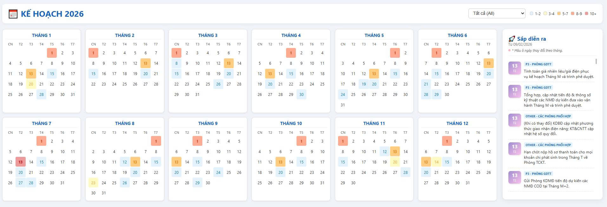

# EPTC Heatmap Dashboard - Hệ thống Quản lý Công việc

Web application trực quan hóa công việc/cảnh báo của các phòng ban trong công ty EPTC qua hệ thống Heatmap Calendar.



## Tính năng

### Dashboard Chính
- **Heatmap Calendar**: 12 tháng với 5 cấp độ màu sắc thể hiện mật độ công việc
  - Xám: Không có việc
  - Xanh: Ít việc (1-2)
  - Vàng: Trung bình (3-4)
  - Cam: Nhiều việc (5-7)
  - Đỏ: Rất nhiều việc (8+)
- **Modal chi tiết**: Click vào ngày để xem danh sách công việc, phân loại theo phòng ban
- **Sidebar "Sắp diễn ra"**:
  - Tự động lọc công việc từ hôm nay trở đi
  - Highlight công việc gấp (trong 3 ngày tới) với viền đỏ + animation
  - Sticky scroll

### Admin Panel
- **Authentication**: Basic Auth với username/password
- **Import Excel**: Upload file .xlsx/.xls để import dữ liệu
- **Preview**: Xem trước dữ liệu trước khi import
- **Merge Logic**: Tự động skip duplicate (dựa trên department + content + date)
- **Statistics**: Hiển thị thống kê tổng quan

### Responsive Design
- Desktop (1920x1080+): 3 tháng/hàng
- Tablet (768-1024px): 2 tháng/hàng
- Mobile (<768px): 1 tháng/hàng, sidebar xuống dưới

## Tech Stack

### Backend
- **Framework**: Flask 3.0
- **Database**: SQLite
- **Authentication**: Session-based với bcrypt
- **Excel Processing**: openpyxl

### Frontend
- **Build Tool**: Vite 5.0
- **Styling**: SCSS
- **JavaScript**: Vanilla ES6+ (no framework)
- **Architecture**: Component-based

## Cấu trúc Project

```
/
├── backend/
│   ├── app.py              # Flask entry point
│   ├── config.py           # Configuration
│   ├── models.py           # Database models
│   ├── auth.py             # Authentication
│   ├── routes/
│   │   ├── api.py          # Public API endpoints
│   │   └── admin.py        # Admin endpoints
│   ├── services/
│   │   ├── excel_processor.py
│   │   └── task_service.py
│   ├── utils/
│   │   └── helpers.py
│   └── requirements.txt
│
├── frontend/
│   ├── index.html          # Dashboard page
│   ├── admin.html          # Admin page
│   ├── src/
│   │   ├── main.js
│   │   ├── admin.js
│   │   ├── components/
│   │   ├── styles/
│   │   └── utils/
│   ├── package.json
│   └── vite.config.js
│
├── docs/
│   └── TECHNICAL_DESIGN.md
│
├── eptc_canhbaocodinh.xlsx # Sample data
└── README.md
```

## Cài đặt

### Yêu cầu
- Python 3.8+
- Node.js 18+
- npm hoặc yarn

### Bước 1: Setup Backend

```bash
# Di chuyển vào thư mục backend
cd backend

# Tạo virtual environment
python3 -m venv venv

# Kích hoạt virtual environment
# Linux/Mac:
source venv/bin/activate
# Windows:
venv\Scripts\activate

# Cài đặt dependencies
pip install -r requirements.txt

# Khởi động server (sẽ tự động tạo database và admin user)
python app.py
```

Server sẽ chạy tại: `http://localhost:5000`

**Thông tin đăng nhập mặc định:**
- Username: `admin`
- Password: `admin123`

⚠️ **LƯU Ý**: Đổi mật khẩu ngay sau lần đăng nhập đầu tiên!

### Bước 2: Setup Frontend

Mở terminal mới:

```bash
# Di chuyển vào thư mục frontend
cd frontend

# Cài đặt dependencies
npm install

# Khởi động dev server
npm run dev
```

Frontend sẽ chạy tại: `http://localhost:5173`

### Bước 3: Import Dữ liệu Mẫu

1. Truy cập: `http://localhost:5173/admin.html`
2. Đăng nhập với `admin` / `admin123`
3. Upload file `eptc_canhbaocodinh.xlsx`
4. Click "Import ngay"
5. Quay lại Dashboard để xem kết quả

## Sử dụng

### Dashboard

1. **Xem Heatmap**: Các ngày có màu đậm = nhiều công việc
2. **Click vào ngày**: Xem chi tiết công việc trong modal
3. **Sidebar**: Theo dõi công việc sắp tới
4. **Legend**: Click "Hiển thị chú thích" để xem ý nghĩa màu sắc

### Admin

1. **Login**: Truy cập `/admin.html`
2. **Import**:
   - Chọn file Excel (.xlsx hoặc .xls)
   - Click "Xem trước" để kiểm tra dữ liệu
   - Click "Import ngay" để import
3. **Statistics**: Xem thống kê tổng quan ở cuối trang

## Format File Excel

File Excel cần có cấu trúc:

| STT | Phòng chủ trì | Nội dung cảnh báo | Ngày cảnh báo |
|-----|---------------|-------------------|---------------|
| 1   | P3            | Nội dung...       | 2026-06-29    |
| 2   | P7            | Nội dung...       | 2026-12-13    |

**Lưu ý:**
- Header ở row 2 (row 1 có thể để trống)
- Dữ liệu bắt đầu từ row 3
- Ngày có format: YYYY-MM-DD hoặc datetime object
- Phòng chủ trì có thể có nhiều phòng cách nhau bởi "/"
- Nội dung là required, các trường khác có thể NULL

## API Endpoints

### Public Endpoints

```
GET /api/tasks                      # Lấy tất cả công việc
GET /api/tasks/by-date?year=2026   # Công việc theo ngày
GET /api/tasks/counts?year=2026    # Đếm số công việc theo ngày
GET /api/tasks/upcoming?limit=20   # Công việc sắp tới
GET /api/tasks/date/<date>         # Công việc của ngày cụ thể
GET /api/departments                # Danh sách phòng ban
GET /api/stats                      # Thống kê tổng quan
```

### Admin Endpoints (Protected)

```
POST /api/admin/login               # Đăng nhập
POST /api/admin/logout              # Đăng xuất
GET  /api/admin/me                  # Thông tin user hiện tại
POST /api/admin/import              # Import Excel
POST /api/admin/preview             # Xem trước Excel
POST /api/admin/change-password     # Đổi mật khẩu
```

## Build Production

### Backend

```bash
cd backend

# Cài đặt production server (gunicorn)
pip install gunicorn

# Chạy production server
gunicorn -w 4 -b 0.0.0.0:5000 app:app
```

### Frontend

```bash
cd frontend

# Build
npm run build

# Preview production build
npm run preview
```

File build sẽ ở thư mục `frontend/dist/`

## Deployment

### Sử dụng Docker (Recommended)

Tạo `Dockerfile` cho backend:

```dockerfile
FROM python:3.11-slim
WORKDIR /app
COPY backend/requirements.txt .
RUN pip install --no-cache-dir -r requirements.txt
COPY backend/ .
CMD ["gunicorn", "-w", "4", "-b", "0.0.0.0:5000", "app:app"]
```

Tạo `docker-compose.yml`:

```yaml
version: '3.8'
services:
  backend:
    build: .
    ports:
      - "5000:5000"
    volumes:
      - ./backend:/app
    environment:
      - FLASK_ENV=production
      - SECRET_KEY=your-secret-key

  frontend:
    image: nginx:alpine
    ports:
      - "80:80"
    volumes:
      - ./frontend/dist:/usr/share/nginx/html
```

Chạy:
```bash
docker-compose up -d
```

### Deploy lên VPS/Cloud

1. Clone repository
2. Setup backend với gunicorn + nginx
3. Build frontend và serve với nginx
4. Setup SSL với Let's Encrypt
5. Cấu hình firewall

## Troubleshooting

### Backend không khởi động được

```bash
# Kiểm tra Python version
python3 --version  # Cần >= 3.8

# Kiểm tra virtual environment
which python  # Phải trỏ tới venv

# Cài lại dependencies
pip install -r requirements.txt --force-reinstall
```

### Frontend không build được

```bash
# Clear cache
rm -rf node_modules package-lock.json

# Cài lại
npm install

# Kiểm tra Node version
node --version  # Cần >= 18
```

### CORS Error

Kiểm tra `backend/config.py`:
```python
CORS_ORIGINS = ['http://localhost:5173', 'http://localhost:5000']
```

### Import Excel bị lỗi

- Kiểm tra format file (phải là .xlsx hoặc .xls)
- Kiểm tra cấu trúc dữ liệu (có đúng columns không)
- Xem log trong terminal backend để biết lỗi chi tiết

## Bảo mật

- ✅ Passwords được hash với bcrypt
- ✅ Session-based authentication
- ✅ File upload validation
- ✅ SQL injection prevention (SQLAlchemy ORM)
- ✅ XSS prevention
- ⚠️ Đổi `SECRET_KEY` trong production
- ⚠️ Đổi mật khẩu admin mặc định
- ⚠️ Setup HTTPS cho production
- ⚠️ Cấu hình firewall

## Performance

- Cache API responses (5 minutes)
- Lazy load months (optional)
- CSS Grid (hardware accelerated)
- Minimized JavaScript bundle
- Database indexes cho `warning_date` và `department`

## Tài liệu kỹ thuật

Xem [TECHNICAL_DESIGN.md](docs/TECHNICAL_DESIGN.md) để biết chi tiết về:
- System architecture
- Database schema
- API specification
- Component design
- Color algorithms
- Merge logic

## License

Copyright © 2026 EPTC. All rights reserved.

## Liên hệ

Nếu có vấn đề hoặc câu hỏi, vui lòng tạo issue hoặc liên hệ team phát triển.

---

**Phát triển bởi Claude Code** 🤖
